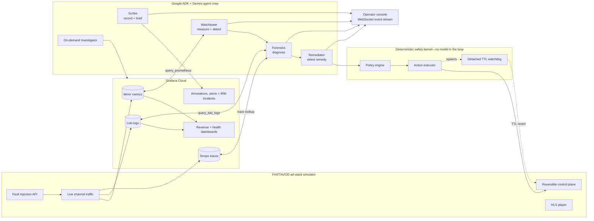
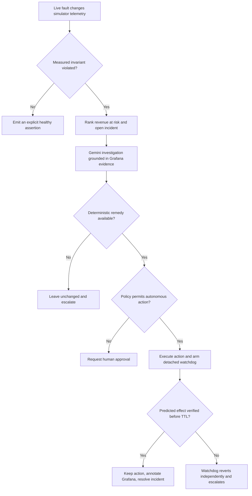
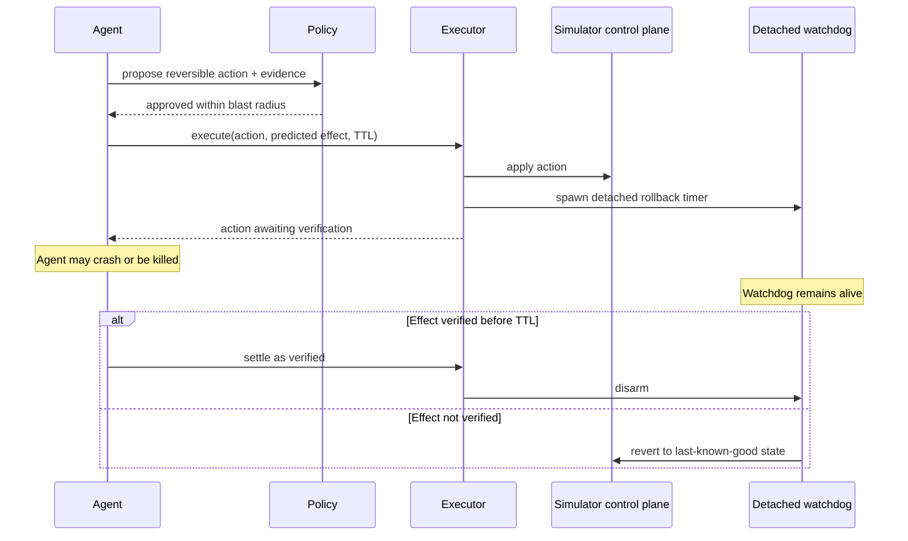

# BreakEven

> **Autonomous revenue-loss incident response for FAST/AVOD streaming—grounded in
> live Grafana evidence, powered by Gemini, and protected by a safety system that
> can revert an action even after the agent dies.**

BreakEven watches a simulated free ad-supported streaming platform, detects silent
ad-delivery failures, translates technical impact into dollars per minute, investigates
the cause with Google ADK agents, and applies bounded corrective actions. Grafana Cloud
is not a dashboard added at the end: its MCP server is the agent's primary runtime
interface for metrics, logs, annotations, alert rules, deep links, and incident response.

Built for **Agentic Cinema: The Blockbuster Hackathon** on the **Grafana partner
track**, using **Google Agent Development Kit (ADK)**, **Gemini on Vertex AI**,
**Grafana Cloud MCP**, and **Cloud Run**.

## Try the live system

The public deployment is ready for judging—no local installation is required.

| Experience | Live link | What to do |
|---|---|---|
| **Fault Lab** | **[Open the simulator](https://breakeven-agent-console-452209142932.asia-south1.run.app/simulator)** | Select a failure mode and inject it into the running ad-stack simulator. |
| **Agent Console** | **[Watch BreakEven operate](https://breakeven-agent-console-452209142932.asia-south1.run.app/agent)** | Follow detection, investigation, remediation, verification, Grafana calls, and the final operator brief in real time. |
| **Raw World State** | **[Inspect the simulator API](https://breakeven-simulator-xgifj6yz3q-el.a.run.app/world)** | View the live channel, creative, pathway, and fault state returned by the simulator. |

Recommended judge flow:

1. Open the **Fault Lab** and the **Agent Console** in separate tabs.
2. Inject a creative failure or beacon blackhole.
3. Watch the continuous agent loop detect the fault without a manual check.
4. Expand **Evidence & proof** to inspect the real Grafana MCP calls and grounded
   claims.
5. Follow the generated dashboard or incident link into Grafana.
6. Clear the fault so the next visitor starts from a healthy system.

## Why this problem matters

FAST services such as Pluto TV, Tubi, and The Roku Channel earn revenue by inserting
ads into free streams. When ad delivery breaks, the platform can lose money on every
affected break while the viewer continues watching.

The hardest failures are not obvious outages. A creative may fail only on one channel
or rendition. An impression beacon may disappear even though the ad rendered correctly.
A CDN pathway may degrade only for one traffic cohort. Aggregate fill-rate alerts either
miss these failures or fire too often to trust.

BreakEven treats the problem as a P&L incident:

- Which channel and cohort are affected?
- How many viewers and ad opportunities are exposed?
- What is the estimated revenue loss per minute?
- What evidence proves the cause?
- Is there a reversible action inside the allowed blast radius?
- Did the action measurably improve the system before its deadline?

## What makes BreakEven different

### 1. It prioritizes money, not alert volume

A small failure on a flagship channel at peak concurrency can matter more than a large
failure on a niche channel overnight. BreakEven joins operational telemetry with channel
CPM, concurrency, breaks per hour, and ads per break to rank incidents by estimated
revenue at risk.

### 2. Detection begins with measured invariants

The language model does not invent the incident. Deterministic checks first establish
that a measured relationship is broken—for example, billable impressions no longer
reconcile with rendered ads. Gemini then explains and investigates a violation that has
already been grounded in telemetry.

This is how BreakEven can expose a **beacon blackhole**: the ad plays, the viewer sees no
error, but the billing signal disappears.

### 3. Every action is a time-bounded experiment

An action must be reversible, supported by evidence, and inside a defined blast radius.
After execution, BreakEven measures the predicted effect. If recovery cannot be proven
within the TTL, a detached watchdog reverts the action independently of the agent.

### 4. Grafana is the operating surface

The agent reads from and writes to Grafana during the incident lifecycle. It queries
Mimir and Loki, reads Tempo traces, adds dashboard annotations, manages alert rules,
opens and updates Grafana IRM incidents, and generates links back to the evidence.

## Architecture



### Runtime layers

| Layer | Responsibility | Source |
|---|---|---|
| Simulator | Seeded channels, ad breaks, HLS playback, fault injection, Prometheus remote-write, Loki logs, Tempo traces, and control endpoints | [`breakeven/sim/`](breakeven/sim/) |
| Agent crew | Detection, Gemini investigation, deterministic remedy selection, lifecycle orchestration, and operator narration | [`breakeven/agents/`](breakeven/agents/) |
| Grafana integration | MCP client, pinned tool contract, and Tempo bridge | [`breakeven/mcp/`](breakeven/mcp/) |
| Safety kernel | Policy decisions, execution, audit records, leases, verification, and watchdog-backed rollback | [`breakeven/policy/`](breakeven/policy/) and [`breakeven/actions/`](breakeven/actions/) |
| Operator experience | FastAPI backend, WebSocket event bus, agent console, and isolated fault lab | [`breakeven/ui/`](breakeven/ui/) |
| Dashboards as code | Importable Revenue Watch and Ad Delivery Health Grafana dashboards | [`dashboards/`](dashboards/) |

## The agent crew

BreakEven separates responsibilities so each stage has a narrow job and a checkable
handoff.

| Component | Role |
|---|---|
| **Watchtower** | Queries current telemetry, evaluates health checks, estimates revenue at risk, suppresses duplicates, and opens an evidence-backed incident candidate. |
| **Forensics** | Uses Gemini with Prometheus, Loki, and trace evidence to explain the failing hop and produce cited root-cause claims. |
| **Remediator** | Maps supported evidence patterns to deterministic actions, checks autonomy eligibility, and refuses unsupported remedies instead of guessing. |
| **Policy Engine** | Allows or rejects an action using typed rules for scope, reversibility, evidence, and blast radius. No model call exists on this path. |
| **Action Executor** | Applies the mutation, records durable state, and launches an independent TTL watchdog before returning control. |
| **Scribe** | Adds Grafana annotations, manages alert rules, opens and updates IRM incidents, generates dashboard links, and writes the operator brief. |
| **Investigator** | Runs a separate, read-only Gemini investigation for an operator-selected channel without changing remediation state. |

## Incident lifecycle



## The safety kernel: safe even when the agent fails

The safety-critical path is plain Python. Gemini can investigate and propose, but it
cannot bypass policy or directly mutate the control plane.

Every executed action includes:

- A typed action and target cohort.
- Evidence supporting the action.
- A maximum blast radius.
- A predicted measurable effect.
- A verification direction and threshold.
- A TTL and a known revert operation.
- Durable audit and state records.

The executor spawns a detached operating-system process that owns the rollback timer.
The watchdog shares no Python memory with the agent process; it reads the durable action
state and calls the revert path itself.



## Grafana Cloud is the agent's runtime interface

BreakEven was designed around the Grafana partner integration. The agent does not scrape
a dashboard or rely on a screenshot. It calls Grafana through the official MCP protocol
while it is operating.

### Grafana data plane

| Grafana capability | How BreakEven uses it |
|---|---|
| **Mimir / Prometheus** | Reads ad requests, fills, errors, billable impressions, beacon failures, slot failures, channel economics, concurrency, and player health. |
| **Loki** | Correlates transcoder and ad-delivery logs, including VAST error codes, with the affected channel and incident window. |
| **Tempo** | Retrieves trace evidence for the failing delivery path through the configured Tempo MCP endpoint. |
| **Dashboards** | Presents an executive revenue view and a technical diagnostic drill-down from version-controlled JSON. |
| **Annotations** | Marks detection, remediation, verification, and escalation events on the incident timeline. |
| **Alerting** | Lists, creates, and repairs channel-aware alert rules from the running agent. |
| **IRM incidents** | Opens an incident, adds lifecycle activities, confirms resolution, and exposes the incident link to the operator. |
| **Deep links** | Requests a Grafana-generated dashboard URL and places it directly in the operator brief. |

### Runtime MCP tool inventory

These are real tool calls with current call sites in the submitted source—not names added
only for the README.

| Grafana MCP tool | Runtime purpose | Call site |
|---|---|---|
| `query_prometheus` | Detection, revenue-at-risk measurement, and post-action verification | [`breakeven/agents/watchtower/agent.py`](breakeven/agents/watchtower/agent.py) |
| `list_datasources` | ADK-native discovery of available Grafana datasources | [`breakeven/agents/probe/agent.py`](breakeven/agents/probe/agent.py) |
| `query_loki_logs` | Log evidence for root-cause investigation | [`breakeven/agents/forensics.py`](breakeven/agents/forensics.py) |
| `create_annotation` | Writes incident and remediation markers to Revenue Watch | [`breakeven/agents/scribe/agent.py`](breakeven/agents/scribe/agent.py) |
| `get_annotations` | Reads annotations back as verification evidence | [`breakeven/agents/verification.py`](breakeven/agents/verification.py) |
| `alerting_manage_rules` | Lists and provisions channel-aware Grafana alert rules | [`breakeven/agents/scribe/agent.py`](breakeven/agents/scribe/agent.py) |
| `create_incident` | Opens a Grafana IRM incident for material revenue loss | [`breakeven/agents/scribe/agent.py`](breakeven/agents/scribe/agent.py) |
| `add_activity_to_incident` | Records lifecycle events on the IRM incident timeline | [`breakeven/agents/scribe/agent.py`](breakeven/agents/scribe/agent.py) |
| `get_incident` | Confirms the final incident state after resolution | [`breakeven/agents/scribe/agent.py`](breakeven/agents/scribe/agent.py) |
| `grafana_api_request` | Uses documented Grafana HTTP APIs where no dedicated MCP operation exists | [`breakeven/agents/scribe/agent.py`](breakeven/agents/scribe/agent.py) |
| `generate_deeplink` | Generates the dashboard URL surfaced in the operator brief | [`breakeven/agents/scribe/agent.py`](breakeven/agents/scribe/agent.py) |

The pinned live `tools/list` response used to validate this contract is included at
[`breakeven/mcp/tools_dump.json`](breakeven/mcp/tools_dump.json).

## Dashboards as code

Both judge-facing Grafana dashboards are version controlled and included in this
repository.

### Revenue Watch—executive incident overview

[`dashboards/revenue-watch.json`](dashboards/revenue-watch.json) contains 13 panels:

- Revenue at risk now
- Affected viewers
- Worst channel slot failure
- Failed-break streak
- Metric emission freshness
- Revenue at risk per minute
- Channel impact ranking
- Flagship billable impressions
- Growth-channel billable impressions
- Slate seconds from failed ad conditioning
- Stream exits during breaks
- Failed-break streak by channel
- Origin 5xx rate by pathway

The central revenue query joins operational failure measurements with channel viewers,
break frequency, ads per break, and CPM. This turns an infrastructure symptom into a
business-priority signal.

### Ad Delivery Health—diagnostic drill-down

[`dashboards/ad-delivery-health.json`](dashboards/ad-delivery-health.json) contains 10
panels across Prometheus and Loki:

- Fill rate by channel
- VAST error breakdown by code from Loki
- Decision latency p50/p95
- Beacon failure ratio
- Player startup time
- Player rebuffer ratio
- Player bitrate switches
- Slot failure ratio
- Failed-break streak
- Origin 5xx rate by pathway

### Importing the dashboards

In Grafana, choose **Dashboards → New → Import** and upload each JSON file. The checked-in
definitions use datasource UIDs `grafanacloud-prom` and `grafanacloud-logs`; map or replace
those UIDs if your Grafana stack uses different names. Keep the Revenue Watch UID
`breakeven-revenue-watch`, because Scribe uses it for annotations and deep links.

## Simulator scope

The simulator is a running system, not a replayed trace.

- **8 channels:** 2 flagship, 4 mid-tier, and 2 niche channels.
- **4 regions:** `us-east`, `us-west`, `eu-west`, and `apac-south`.
- **3 device classes:** connected TV, mobile, and web.
- Channel-specific concurrency, CPM, break frequency, and ads-per-break economics.
- Prometheus remote-write metrics, Loki log pushes, and Tempo trace pushes.
- A live HLS player with visible ad/program transitions.
- Control endpoints for creative blocklisting and pathway steering.
- A separate fault lab so judges can distinguish the product from its test rig.

### Injectable fault shapes

| Fault | What it models | Observable evidence |
|---|---|---|
| **Creative transcode failure** | One creative fails conditioning for a channel/rendition | VAST 900 logs, error/fill changes, visible creative rotation |
| **Beacon blackhole** | Ads render but billing beacons disappear | Impression-conservation violation without a viewer-facing playback error |
| **Origin degradation** | One CDN pathway begins returning failures | Pathway-specific origin 5xx and player-quality changes |
| **Stitch corruption** | Failed ad conditioning creates slate time | Slate seconds and delivery-health degradation |

### Implemented action shapes

- Blocklist a failing creative and move rotation to the next eligible creative.
- Steer traffic from a degraded pathway to its healthy sibling through a bounded,
  hash-stable ramp.
- Contain a beacon-blackhole channel by removing its active creatives until billing
  integrity is restored.

BreakEven deliberately refuses to invent a remedy outside its deterministic mappings.
Unsupported cases remain unchanged and are escalated instead of being forced through a
plausible-sounding action.

## Google Cloud and Gemini

| Technology | Role in BreakEven |
|---|---|
| **Google ADK** | Defines and runs the specialized agent crew, sessions, tool-enabled Gemini agents, and model handoffs. |
| **Gemini on Vertex AI** | Produces evidence-cited investigation and operator-facing explanations after deterministic detection establishes a real incident. |
| **Cloud Run** | Hosts the public simulator, agent console, and Grafana MCP service with scale-to-zero deployment. |
| **Secret Manager** | Supplies Grafana service-account and telemetry credentials at runtime without committing secrets. |
| **Application Default Credentials** | Authenticates local and deployed access to Vertex AI and Secret Manager. |

## Operator experience

The FastAPI console streams structured events over WebSocket as they happen. It is not a
chat transcript reconstructed after the run.

The `/agent` view exposes:

- The active detection and remediation pipeline.
- Evidence-backed root-cause claims.
- Every Grafana MCP call with bounded arguments and result summaries.
- Policy decisions and action state.
- Watchdog armed/reverted status.
- Grafana dashboard, alert, and incident links.
- A human approval surface for actions that are not autonomy-eligible.
- A kill control that demonstrates watchdog independence.
- An isolated, read-only on-demand investigation panel.

The `/simulator` view exposes fault injection, world state, and the live player separately
from the agent product surface.

## Repository layout

```text
.
├── breakeven/
│   ├── actions/       # reversible execution, audit, leases, verification, watchdog
│   ├── agents/        # Watchtower, Forensics, Remediator, Scribe, Investigator
│   ├── mcp/           # Grafana MCP client and validated tool contract
│   ├── policy/        # deterministic autonomy and blast-radius policy
│   ├── sim/           # live FAST/AVOD simulator, telemetry, faults, player
│   └── ui/            # FastAPI + WebSocket operator console and fault lab
├── dashboards/
│   ├── revenue-watch.json
│   └── ad-delivery-health.json
├── .env.example
├── requirements.txt
└── LICENSE
```

## Run locally

The hosted deployment is the fastest way to evaluate BreakEven. Local operation requires
access to the configured Google Cloud project and Grafana stack.

### Prerequisites

- Python 3.11 or newer
- Google Cloud CLI
- Docker, or another reachable deployment of `grafana/mcp-grafana`
- Application Default Credentials with Vertex AI and Secret Manager access
- A Grafana Cloud stack with Prometheus/Mimir, Loki, Tempo, and IRM access

The application reads these Secret Manager entries from project
`breakeven-pnl-agent`:

- `grafana-sa-token`
- `grafana-metrics-write-token`
- `grafana-logs-write-token`
- `grafana-traces-write-token`
- `grafana-traces-read-token`

### 1. Install dependencies

```bash
git clone https://github.com/Balaastratech/Breakeven.git
cd Breakeven
python -m venv .venv
```

Activate the environment:

```bash
# macOS/Linux
source .venv/bin/activate

# Windows PowerShell
.\.venv\Scripts\Activate.ps1
```

Then install:

```bash
python -m pip install --upgrade pip
python -m pip install -r requirements.txt
```

### 2. Configure Google Cloud and the environment

```bash
gcloud auth application-default login
gcloud config set project breakeven-pnl-agent
```

Copy [`.env.example`](.env.example) to `.env`, review the endpoints, and load the
values into the shell. BreakEven intentionally does not auto-load `.env`.

```bash
# macOS/Linux
cp .env.example .env
set -a
source .env
set +a
```

```powershell
# Windows PowerShell
Copy-Item .env.example .env
Get-Content .env |
  Where-Object { $_ -and -not $_.StartsWith('#') } |
  ForEach-Object {
    $name, $value = $_ -split '=', 2
    Set-Item -Path "Env:$name" -Value $value
  }
```

The agent requires:

```text
GOOGLE_GENAI_USE_VERTEXAI=TRUE
GOOGLE_CLOUD_PROJECT=breakeven-pnl-agent
GOOGLE_CLOUD_LOCATION=us-central1
BREAKEVEN_SIM_URL=http://127.0.0.1:8080
BREAKEVEN_MCP_ENDPOINT=http://127.0.0.1:8000/mcp
```

### 3. Start Grafana MCP

Run the official [`grafana/mcp-grafana`](https://github.com/grafana/mcp-grafana)
server in streamable-HTTP mode on port `8000`, configured with your Grafana URL and
service-account token. Confirm its endpoint is available at the URL in
`BREAKEVEN_MCP_ENDPOINT`.

### 4. Start the simulator

```bash
python -m breakeven.sim.api
```

The simulator listens on `http://127.0.0.1:8080`. Its Cloud Run design is
request-driven; call `POST /tick` to advance a local run and emit telemetry:

```bash
curl -X POST http://127.0.0.1:8080/tick
```

When writing local telemetry to the configured Grafana stack, keep
`BREAKEVEN_ALLOW_LOCAL_METRICS_WRITE=1` set as shown in `.env.example`.

### 5. Start the agent and console

In a second configured terminal:

```bash
python -m breakeven.agents.orchestrator
```

Open:

- `http://127.0.0.1:8081/agent` for the autonomous-agent console.
- `http://127.0.0.1:8081/simulator` for the fault lab.

## Honest scope and deployment notes

- The simulator exposes four fault shapes; autonomous remedy coverage is intentionally
  bounded to deterministic mappings rather than arbitrary control-plane changes.
- Local users need their own authorized Google Cloud and Grafana credentials. No secret
  is stored in this repository.
- The operator console contains incident telemetry and has no built-in authentication.
  Local mode binds to loopback by default. Protect it before using it outside a controlled
  demo environment.
- Runtime incident and fault state is process-local. The hosted services use a single
  instance to avoid splitting that state across replicas.
- Email escalation is optional and best-effort; failures never block the safety path.

## Technology stack

**Python 3.11+ · Google ADK · Gemini · Vertex AI · Grafana Cloud MCP · Mimir · Loki ·
Tempo · Grafana IRM · FastAPI · WebSocket · Cloud Run · Secret Manager · HLS**

## License

BreakEven is released under the [MIT License](LICENSE).
